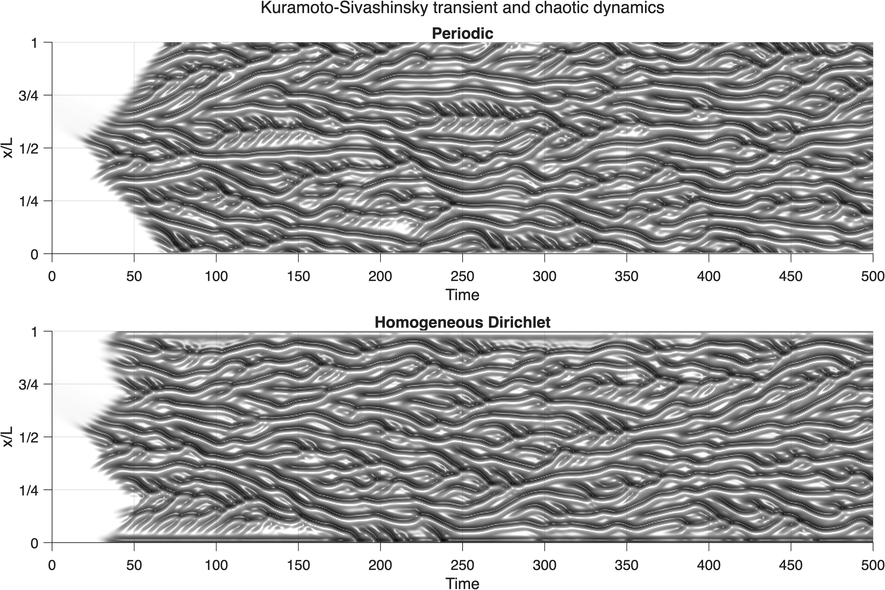

# Kuramoto-Sivashinsky solver

A small MATLAB solver for the one-dimensional Kuramoto-Sivashinsky (KS)
equation. It supports periodic boundaries and zero-valued (homogeneous
Dirichlet) boundaries, and returns the complete solution history for plotting
or analysis.

The KS equation is a standard model for nonlinear pattern formation and
spatiotemporal chaos. In the convention used here, it is

```text
u_t + u u_x + v2 u_xx + v4 u_xxxx = 0.
```

The second-derivative term destabilizes long waves, the fourth-derivative term
damps short waves, and the nonlinear term transfers energy between scales. The
default values are `v2 = 1` and `v4 = 1`.

## Requirements

- MATLAB
- No additional MATLAB toolboxes

Clone or download this repository, start MATLAB, and change to the repository
directory. Add the solver to the MATLAB path:

```matlab
addpath('src')
```

## Quick start

Create a configuration structure and pass it to `solveKS`:

```matlab
config.boundary = 'periodic';
config.L = 128;       % Domain length
config.N = 256;       % Number of grid points
config.dt = 0.25;     % Time-step size
config.steps = 2000;  % Integrate through t = 500

config.initial = @(x) 0.5*sin(2*pi*x/config.L) ...
    .* (1 + 0.3*sin(4*pi*x/config.L));

[t,x,u] = solveKS(config);
plotKSSpacetime(t,x,u, ...
    'DomainLength',config.L, ...
    'Title','Periodic');
```

Here, `u(i,j)` is the solution at position `x(i)` and time `t(j)`. The first
column, `u(:,1)`, contains the initial condition. `plotKSSpacetime` creates a
figure by default; its optional `Parent` and `ColorLimit` values support tiled
plots with a shared symmetric color scale.

## Configuration and grids

| Field | Required | Description |
| --- | --- | --- |
| `boundary` | Yes | `'periodic'` connects both sides; `'dirichlet'` fixes `u(0) = u(L) = 0`. |
| `L` | Yes | Positive domain length. |
| `N` | Yes | Spatial point count; its boundary-specific meaning is described below. |
| `dt` | Yes | Positive time-step size. |
| `steps` | Yes | Nonnegative integer number of time steps. |
| `initial` | Yes | Function handle evaluated on `x`, or a numeric vector with one value for each returned grid point. |
| `v2` | No | Coefficient of `u_xx`. Defaults to `1`. |
| `v4` | No | Coefficient of `u_xxxx`. Defaults to `1`. |
| `Cs` | No | Nonnegative subgrid-scale model coefficient. If omitted, the model is disabled. |

For a periodic run, `N` must be even. The returned grid has `N` points at
`L/N, 2L/N, ..., L`; `0` and `L` represent the same location, so only `L` is
stored. For a Dirichlet run, `N` counts interior points and the returned grid
adds both endpoints, giving `N + 2` values.

A numeric initial condition can be supplied instead of a function handle:

```matlab
x0 = config.L*(1:config.N)'/config.N;  % Periodic grid
config.initial = sin(2*pi*x0/config.L);
```

For a Dirichlet run, the numeric vector must contain `N + 2` values. The
solver replaces nonzero endpoint values with zero.

## Outputs

| Output | Shape | Description |
| --- | --- | --- |
| `t` | `1 x (steps + 1)` | Times from `0` through `steps*dt`. |
| `x` | `N x 1` or `(N + 2) x 1` | Spatial grid. |
| `u` | `numel(x) x (steps + 1)` | Complete solution history. |

Because `solveKS` stores every state, memory use grows with both `N` and
`steps`. For example, doubling either value approximately doubles the memory
required for `u`.

## Comparison and validation

Run `examples/compare_boundaries.m` to apply the Quick Start parameters and
initial condition to both boundary types. The script covers the transient and
developed chaotic dynamics, then plots both histories with the original
grayscale lit-surface style:

```matlab
run('examples/compare_boundaries.m')
```



The case was run with MATLAB R2026a and checked for the following properties:

| Check | Periodic | Dirichlet |
| --- | --- | --- |
| Output size | `256 x 2001` | `258 x 2001` |
| All values finite | Passed | Passed |
| Boundary values remain zero | Not applicable | Passed exactly |
| Initial-to-final state changes | Passed | Passed |

The two panels use one symmetric color limit, so their amplitudes can be
compared directly. This test checks execution, output dimensions, boundary
enforcement, and sustained dynamics. It is not a grid- or time-step-convergence
study; quantitative work should still check convergence for its chosen
parameters.

The committed image is exported at 400 DPI. The script locates `src` relative
to its own path, including when launched by absolute path.

## Numerical method

The solver uses a Fourier spectral discretization in space and the fourth-order
exponential time-differencing Runge-Kutta method (ETDRK4) in time.

- Periodic solutions are advanced directly on a Fourier grid.
- Dirichlet solutions are represented by an odd extension onto a periodic
  domain of length `2L`. Odd symmetry keeps the values at `x = 0` and `x = L`
  equal to zero.
- The optional `Cs` setting adds a subgrid-scale (SGS) viscosity model.

The implementation does not apply spectral dealiasing.

## Advanced use: stepping without storing every state

For long simulations, use the lower-level functions to process or save each
state as it is produced. This periodic example keeps only the current state:

```matlab
L = 64; N = 128; dt = 0.01;

x = L*(1:N)'/N;
state = sin(2*pi*x/L);
coeff = buildETDRK4('periodic',L,N,dt,1,1);

for step = 1:1000
    [~,flow] = stepKSPeriodic(coeff,L,N,state);
    state = flow(:,1);
end
```

For Dirichlet boundaries, replace the grid, state, coefficients, and loop with:

```matlab
xInterior = (1:N)'*L/(N+1);
state = sin(pi*xInterior/L);
coeff = buildETDRK4('dirichlet',L,N,dt,1,1);

for step = 1:1000
    [~,flow] = stepKSDirichlet(coeff,L,N,state);
    state = flow(2:end-1,1);
end
```

The first column of `flow` is the new solution. Columns two through five are
its first through fourth spatial derivatives. When `Cs` is supplied, column
six contains the SGS viscosity. Both step functions accept an optional final
`Cs` argument. The time-step size is stored in `coeff` when `buildETDRK4` is
called; rebuild the coefficients before changing it.

## Repository layout

| Path | Purpose |
| --- | --- |
| `src/solveKS.m` | Main interface for configuring and running a simulation. |
| `src/buildETDRK4.m` | Builds the spectral grid and ETDRK4 coefficients. |
| `src/stepKSPeriodic.m` | Advances a periodic solution by one time step. |
| `src/stepKSDirichlet.m` | Advances a Dirichlet solution by one time step. |
| `src/plotKSSpacetime.m` | Plots a solution with the original grayscale lit-surface style. |
| `examples/compare_boundaries.m` | Compares the two boundary conditions. |
